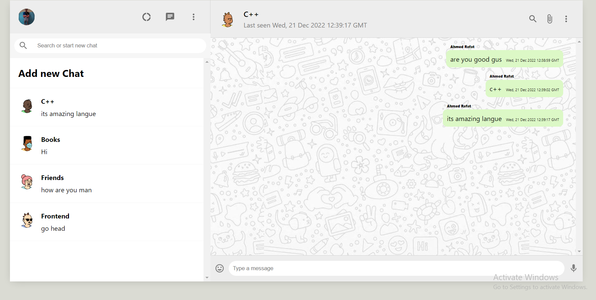

# WhatsApp Clone
It is chat messaging app created with react.js and readx.js , firebase to handel google authanication,  database and create rooms for chat with friends and use css to style.

## Live Demo:
   - Hosting URL: https://whatsapp-clone-30ea1.web.app 

## Features
  - Advanced React Best Practices such as
    - Folder and file structure, hooks.
  - Advanced State Management of the entire application using Redux and React Context API
  - Use Firebase to handle google authentication and use Realtime Database for creating rooms to chat with your friends.
  - Through Firebase, Make Hoisting to App.

## Technologies
Project is created with:
   - React.js
   - Redux.js
   - Firebase
   - React Context API
   - React Hooks (useState, useEffect)
   - css
   - Responsevie Layout

